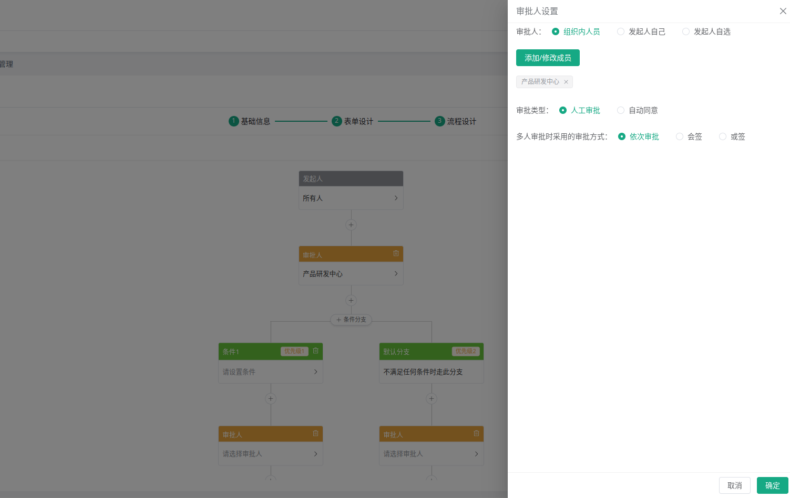
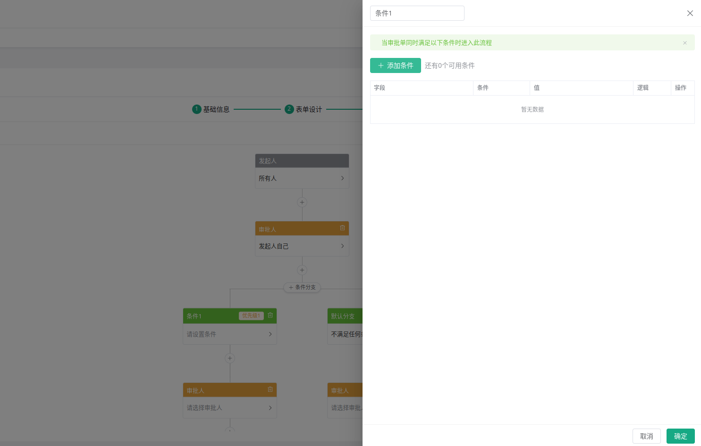
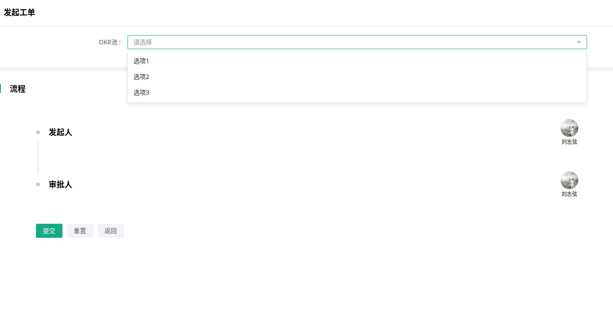
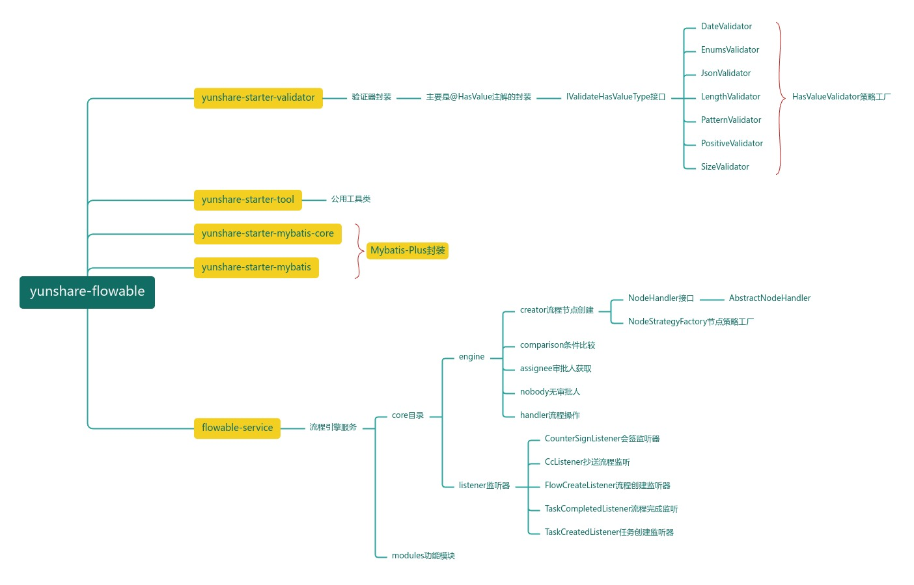

# 
<strong> Yunshare-Flowable </strong>

### 概述
线上看了一些基于Flowable开发的工作流引擎，发现编码都比较复杂与混乱，于是自己封装了工作流引擎，开源出来，大家可以参考。

### 前端效果

### 环境要求
    java8
    springboot 2.3.12.RELEASE
    flowable 6.7.2
    mysql 8.0.22
    mybatis-plus 3.4.3.1
    knife4j 2.0.8

### 快速开始
#### 1. 导入sql文件
    > 将doc目录下的[yunshare_bpm.sql.zip](doc%2Fyunshare_bpm.sql.zip)文件解压导入到数据库中
#### 2. 配置环境变量
    MYSQL_HOST=127.0.0.1;
    MYSQL_PASSWORD=123456;
    MYSQL_PORT=3306;
    MYSQL_USERNAME=root;
    SERVICE_PORT=30001
#### 3. 启动项目
    127.0.0.1:30001/doc.html 即可查看接口文档

### 代码结构说明

### 开发计划
> 目前版本还比较粗略，只处理了流程模型，节点、连线、分支管理等，后续会持续更新，将其完善成一个完整的工作流引擎。
>#### 1. 简化代码，使用更简单
>#### 2. 完善流程引擎的前端使用，添加待办等相关功能
>#### 3. 开发前端模块，实现流程的创建、编辑、删除、启动、查询、审批等[vue3、ts、element-plus]

### 关于开源协议以及补充协议
>#### 1. 不得将本软件应用于危害国家安全、荣誉和利益的行为，不能以任何形式用于非法为目的的行为
>#### 2. 任何基于本软件而产生的一切法律纠纷和责任，均与作者无关